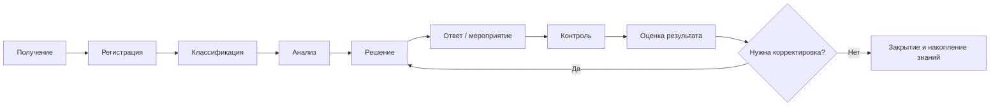
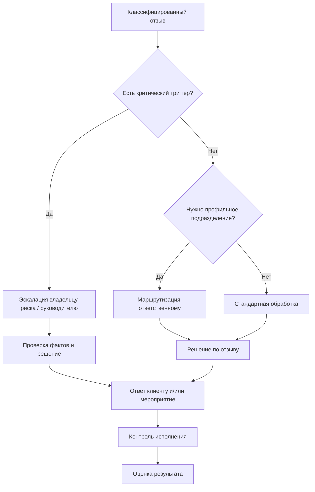
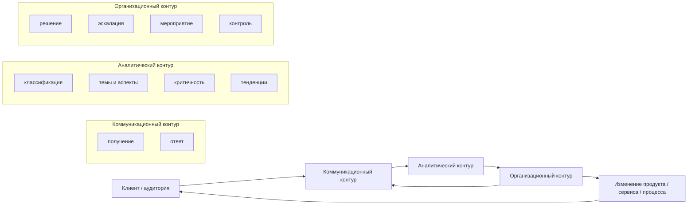

# Методика ЕГ — теоретическая модель работы с отзывами T2

Статус: **T2 CANON / NO-CODE**

Назначение документа — определить единую теоретическую модель работы с клиентскими отзывами, которая используется одновременно:
- в главе 1 как авторский синтез научных подходов;
- в главе 2 как эталон для сопоставления с наблюдаемым AS-IS фактического эмпирического объекта — сети «Перекрёсток»;
- в главе 3 как основа проектной TO-BE программы **«Методика ЕГ»**.

Модель не требует программной реализации.

## 1. Исходные принципы

1. Отзыв рассматривается одновременно как коммуникационный акт, источник данных о клиентском опыте и сигнал для управленческого решения.
2. Отрицательная тональность не равна высокой критичности.
3. Один отзыв может содержать несколько тем/аспектов.
4. Публичный ответ клиенту и внутреннее корректирующее мероприятие — разные, но связанные действия.
5. Работа с отзывом не завершается публикацией ответа: требуется контроль исполнения и оценка результата.
6. Автоматические методы анализа могут поддерживать процесс, но не заменяют экспертную интерпретацию спорных и критических случаев.
7. Каждое значимое решение должно быть прослеживаемым: исходный отзыв → классификация → решение → действие → контроль → результат.

Опорные источники: № 1, 3, 7, 9, 12, 27, 33, 38–40 из `SOURCES_40_MASTER.md`.

## 2. Канонический жизненный цикл

Верхнеуровневый процесс фиксируется без изменений:

**получение → регистрация → классификация → анализ → решение → ответ/мероприятие → контроль → оценка результата**.

### 2.1 Получение

Источники: маркетплейсы и агрегаторы, сайт организации, социальные сети, мессенджеры, электронная почта, формы обратной связи и иные разрешённые каналы.

Результат этапа: отзыв попадает в единый контур обработки с сохранением источника и контекста.

### 2.2 Регистрация

Фиксируются минимум:
- дата/время;
- источник/канал;
- текст/содержание;
- объект отзыва: товар, услуга, процесс, подразделение или организация;
- доступные атрибуты автора без избыточной обработки персональных данных;
- публичность/видимость;
- исходная ссылка или иной идентификатор происхождения.

Результат: отзыв становится учтённой единицей процесса.

### 2.3 Классификация

Отзыв описывается по нескольким независимым измерениям; классификация не сводится к одной метке.

Обязательные измерения:
1. источник/канал;
2. тональность;
3. тема/аспекты;
4. критичность;
5. стадия обработки.

Дополнительные проектные измерения могут включать тип клиента, продуктовую категорию, регион, повторность проблемы и публичный охват — только если такие данные действительно доступны и допустимы к обработке.

### 2.4 Анализ

На этапе анализа определяется не только «положительный/отрицательный» характер сообщения, но и:
- что именно произошло;
- какие аспекты затронуты;
- есть ли повторяющаяся проблема;
- каковы возможные клиентские, коммуникационные, правовые и репутационные последствия;
- требуется ли дополнительная проверка фактов;
- кто должен принять решение.

### 2.5 Решение

Для каждого значимого отзыва определяется комбинация действий:
- ответ клиенту;
- уточнение информации;
- передача профильному подразделению;
- сервисное восстановление/исправление ситуации;
- эскалация;
- корректирующее мероприятие;
- аналитическое наблюдение без отдельного вмешательства;
- закрытие как не требующего дальнейших действий.

### 2.6 Ответ / мероприятие

**Ответ** — коммуникационное действие по отношению к клиенту/аудитории.

**Мероприятие** — внутреннее действие организации, устраняющее причину, последствия или риск.

Один отзыв может требовать одновременно ответа и мероприятия.

### 2.7 Контроль

Проверяется:
- выполнено ли принятое решение;
- соблюдены ли установленные правила и сроки;
- подтверждено ли устранение проблемы;
- требуется ли повторная коммуникация;
- возникли ли повторные отзывы по той же проблеме.

### 2.8 Оценка результата

Возможные результаты:
- проблема устранена;
- клиент получил ответ, но причина не устранена;
- требуется дополнительное мероприятие;
- выявлена системная проблема;
- отзыв не подтвердился/не требует действий;
- необходима дальнейшая эскалация.

На этом этапе формируется связь с KPI и накоплением организационного знания.

## 3. Многокритериальный классификатор

### 3.1 Тональность

| Код | Категория | Рабочий смысл |
|---|---|---|
| S+ | Положительная | преобладающая положительная оценка опыта/объекта |
| S0 | Нейтральная | информационное, смешанное или оценочно невыраженное сообщение |
| S- | Отрицательная | преобладающая отрицательная оценка опыта/объекта |

Тональность характеризует оценочную направленность сообщения, но **не определяет автоматически приоритет обработки**.

### 3.2 Темы/аспекты

Базовый проектный классификатор:
- качество товара/услуги;
- цена/условия покупки;
- доставка/сроки;
- обслуживание/сервис;
- персонал;
- поддержка/обратная связь;
- возврат/возмещение/претензия;
- цифровые каналы/сайт/приложение;
- наличие/ассортимент;
- другое.

Один отзыв может иметь несколько аспектов. Состав категорий уточняется по результатам фактического контент-анализа исследуемого объекта и не должен подгоняться под заранее желаемое распределение.

### 3.3 Критичность

Критичность — авторский операциональный параметр приоритета обработки.

| Уровень | Смысл | Типовая логика реакции |
|---|---|---|
| C1 Низкая | единичное замечание без существенного ущерба и признаков эскалации | стандартная обработка |
| C2 Средняя | заметное неудовлетворение, повторяющаяся проблема или необходимость участия профильного подразделения | приоритетная маршрутизация |
| C3 Высокая | существенный ущерб клиентскому опыту, высокая публичность, повторяемость, риск конфликта или значимое нарушение процесса | оперативная эскалация ответственному владельцу |
| C4 Критическая | возможный серьёзный правовой, безопасностный, репутационный или массовый эффект | немедленное управленческое рассмотрение по отдельному регламенту |

Точные SLA и должностные маршруты формируются в T4/T5 как проектные параметры и адаптируются к реальной организационной структуре при внедрении.

### 3.4 Факторы критичности

Критичность оценивается не по эмоциональности текста, а по совокупности факторов:
- возможный ущерб клиенту;
- правовой/комплаенс-риск;
- риск безопасности;
- потенциальный репутационный эффект и публичность;
- массовость/повторяемость;
- срочность обратимого действия;
- вероятность дальнейшего распространения проблемы;
- необходимость решения на уровне руководителя.

## 4. Почему тональность и критичность разделены

Примеры логики:

| Ситуация | Тональность | Возможная критичность | Причина |
|---|---|---|---|
| «Курьер опоздал на 15 минут, неприятно» | отрицательная | C1 | локальное неудовлетворение без серьёзного ущерба |
| «Со счёта дважды списали оплату» | может быть нейтральной по формулировке | C3 | финансовый ущерб и необходимость оперативного исправления |
| «Всё понравилось, но в упаковке была деталь, которой ребёнок мог подавиться» | смешанная/положительная | C4 | потенциальный риск безопасности |
| «Поддержка третий раз не решает одну и ту же проблему» | отрицательная | C2/C3 | повторяемость и сбой процесса |

Следовательно, использование только sentiment analysis недостаточно для управляемой работы с отзывами.

## 5. Модель реакции и эскалации

### Критические триггеры верхнего уровня

- угроза жизни/здоровью/безопасности;
- признаки нарушения законодательства или существенного нарушения прав потребителя;
- утечка/неправомерное использование персональных данных;
- массовая или быстро распространяющаяся проблема;
- существенный финансовый ущерб;
- высокая публичность/медиариск;
- повторяющаяся проблема, которую стандартный процесс не устранил;
- конфликт, требующий решения вне полномочий первой линии.

Наличие триггера означает обязанность рассмотреть эскалацию, а не автоматическое признание обвинения клиента достоверным. Факты подлежат проверке.

## 6. Ролевая модель верхнего уровня

T2 фиксирует функции, но не приписывает фактические должности сети «Перекрёсток». Детальная RACI проектируется в T4 и сопоставляется с реальными должностями только при внедрении.

| Роль | Ответственность в модели |
|---|---|
| Владелец процесса обратной связи | правила процесса, KPI, межфункциональная координация, изменения регламента |
| Первая линия / оператор обратной связи | регистрация, первичная классификация, стандартная коммуникация, маршрутизация |
| PR / специалист по цифровой репутации | публичная коммуникация, репутационные риски, чувствительные ответы, мониторинг медиаконтекста |
| Владелец продукта/сервиса/бизнес-процесса | анализ причины и корректирующее мероприятие по своей зоне ответственности |
| Юридическая/комплаенс-функция | правовые риски, претензии, персональные данные, спорные формулировки |
| Руководитель/эскалационный уровень | решения по C4, системным и межфункциональным проблемам |
| Аналитическая функция | агрегирование тем, повторяемости, KPI, тенденций и материалов для решений |

В небольшой организации несколько ролей могут совмещаться одним сотрудником; важно не количество должностей, а наличие функций и ответственности.

## 7. Трёхконтурная модель «Методики ЕГ»

Смысл модели: отзыв не должен оставаться только объектом публикационного ответа или только строкой аналитики. Информация должна переходить из коммуникации в анализ, затем в организационное решение и возвращаться в коммуникационный/клиентский контур через результат.

## 8. Связь с главами ВКР

### Глава 1
Модель используется для:
- определения места отзыва в PR-коммуникации;
- объяснения связи отзыва, CX и цифровой репутации;
- систематизации методов классификации и анализа;
- формирования авторской позиции по необходимости процессного подхода.

### Глава 2
Модель используется как теоретический эталон для сопоставления с публично наблюдаемым AS-IS сети «Перекрёсток». Публичные данные позволяют оценивать структуру отзывов, каналы, аспекты, рейтинг/тональность, criticality screening и видимый ответ, но не позволяют без внутренних документов утверждать наличие или отсутствие конкретных внутренних SLA, владельцев и маршрутизации.

### Глава 3
Модель становится основой TO-BE и конкретизируется через:
- регламент;
- RACI;
- дерево решений;
- KPI;
- схемы;
- функциональную/информационную архитектуру;
- план внедрения.

## 9. Трассировка к научной базе

| Элемент модели | Основные источники |
|---|---|
| отзыв как управляемая обратная связь | № 1, 3 |
| отзыв как цифровой коммуникативный жанр | № 12 |
| клиентский опыт | № 4–6, 18–19 |
| цифровая репутация | № 7, 9, 21, 39 |
| влияние онлайн-отзывов | № 2, 28–29, 38 |
| тональность и ограничения автоматизации | № 22–27, 40 |
| аспектный анализ | № 22–24, 40 |
| претензии и процессный контроль | № 32–34, 37 |
| реакция организации на отзывы | № 1, 3, 39 |

## Gate T2

T2 считается закрытым, если:
1. канонический жизненный цикл определён;
2. независимость тональности, аспекта и критичности зафиксирована;
3. базовый классификатор определён;
4. факторы критичности сформулированы;
5. модель реакции/эскалации определена;
6. верхнеуровневые роли определены;
7. коммуникационный, аналитический и организационный контуры связаны;
8. модель привязана к научной базе;
9. определена связь с главами 1–3;
10. модель не требует и не предполагает обязательной кодовой реализации.

**T2 MODEL STATUS = COMPLETE**
