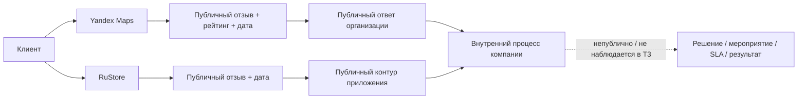

# FeedbackPro — T3: паспорт эмпирического объекта и наблюдаемый AS-IS

Статус: **FACTUAL EMPIRICAL BASELINE / PEREKRESTOK / PUBLIC CONTOUR**

## 1. Исследовательский объект

Фактический объект главы 2 — торговая сеть **«Перекрёсток»**, супермаркетный бренд X5.

Исследование ограничено **публично наблюдаемым контуром клиентских отзывов**. Публичные данные позволяют анализировать сами отзывы, оценки, темы/аспекты, публичные ответы и источник публикации, но не раскрывают внутренние SLA, владельцев задач, маршрутизацию, корректирующие мероприятия и управленческие решения.

Поэтому ранее использовавшаяся модельная формулировка «организация N с ручным разрозненным процессом» считается **SUPERSEDED для T3**. Непубличные внутренние недостатки «Перекрёстка» не приписываются компании без evidence.

## 2. Эмпирические границы

Период: **01.09.2025–31.08.2026**.

Целевой объём: **1200 отзывов**.

Acquisition pool: **1302 уникальных пригодных записи**.

Итоговый детерминированный аналитический корпус: **1200**.

Фактические источники внутри периода:
- **Yandex Maps — 1192**;
- **RuStore — 8**.

Плановая таксономия будущей системы по-прежнему допускает сайт/форму, маркетплейс, сервис отзывов/карты и прямой канал, но T3 не заполняет отсутствующие публичные данные синтетически.

## 3. Наблюдаемый AS-IS публичного контура

Фактически наблюдается:
- отзывы о магазинах сети публикуются на нескольких внешних площадках;
- Yandex Maps предоставляет текст, дату, рейтинг, идентификатор карточки и публичный ответ организации;
- RuStore предоставляет публичные отзывы приложения; в использованном storefront extract индивидуальный рейтинг не был надёжно доступен и поэтому не восстанавливался искусственно;
- схемы и наборы полей источников различаются;
- в 1192/1200 строк корпуса доступен рейтинг 1–5;
- в 1192/1200 строк виден публичный ответ организации;
- внутреннее решение, corrective action, SLA, владелец и подтверждение фактического устранения проблемы публичные платформы не раскрывают.

## 4. Схема наблюдаемого AS-IS

## 5. Что T3 может доказать

T3 может доказательно оценивать:
- структуру источников внутри собранного корпуса;
- распределение оценок;
- rating-based sentiment proxy;
- rule-based частоту аспектов;
- rule-based screening C1–C4;
- повторяемость тем;
- наличие публичного ответа;
- различие публичной коммуникации и непубличного результата;
- необходимость единой аналитической модели для сопоставления публичных каналов.

## 6. Что T3 не может доказать

Без внутренних документов/выгрузок нельзя утверждать:
- что отзывы внутри компании просматриваются вручную;
- что отсутствует единая CRM/система учёта;
- что нет SLA;
- что отсутствуют владельцы и эскалация;
- что публичный ответ означает отсутствие/наличие корректирующего действия;
- что конкретный C3/C4 screening case является подтверждённым нарушением.

Такие элементы в T4 могут появляться как **проектные требования**, но не как фактические обвинительные выводы главы 2.

## 7. Research questions — фактически закрываемые корпусом

1. Как распределены отзывы по доступным публичным платформам и времени?
2. Какова структура рейтингов и rating-based sentiment proxy?
3. Какие темы/аспекты повторяются чаще всего?
4. Какие аспекты связаны с отрицательными оценками и повышенной критичностью?
5. Как распределяются C1–C4 screening codes?
6. Есть ли C3/C4 случаи, которые не были бы обнаружены простым фильтром рейтинга 1–2?
7. Какова видимость публичного ответа организации?
8. Какие проблемы/ограничения можно доказать по публичным данным, а какие остаются `NOT ASSESSABLE INTERNALLY`?
9. Какие требования TO-BE следуют из доказанных наблюдений и из теоретической модели T2?

## 8. Evidence

Фактический корпус, manifest, coded dataset, таблицы, диаграммы и P1–P8 находятся в `research/t3/output/` и суммированы в `T3_FINAL_EVIDENCE.md`.
