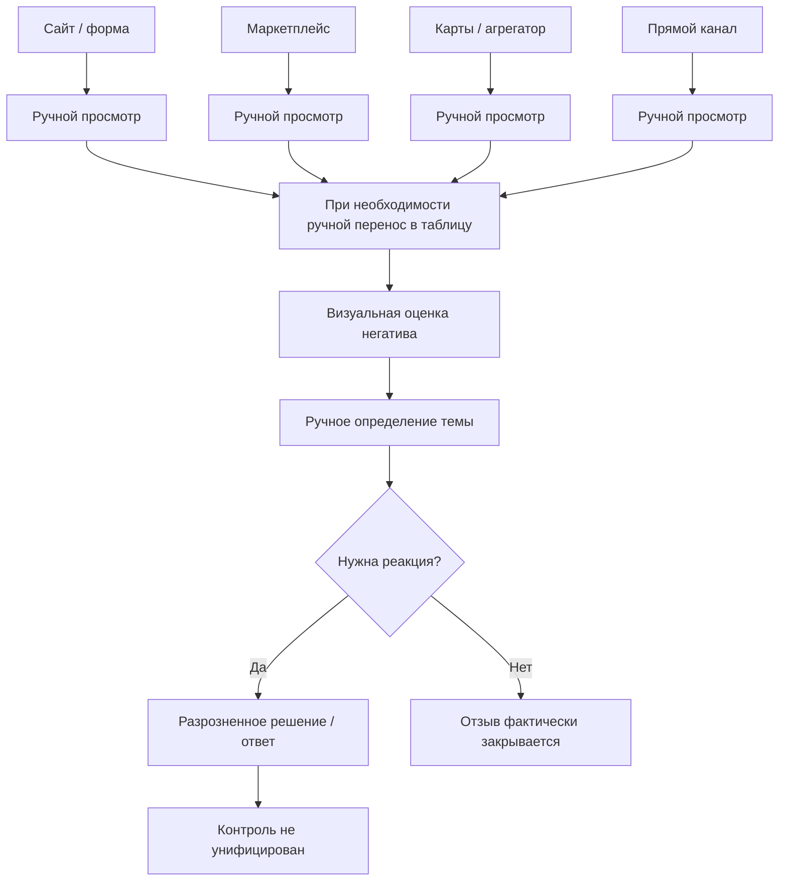

# FeedbackPro — T3: паспорт организации N и AS-IS

Статус: **T3 ANALYTICAL BASELINE / NO FABRICATED RESULTS**

## 1. Исследовательский объект

Рабочий объект главы 2 — **модельная обезличенная коммерческая организация N** в сфере омниканальной розничной/онлайн-торговли потребительскими товарами.

Организация N не является реально существующей компанией и не должна описываться через вымышленные факты, финансовые показатели, штат или рыночные доли.

Исследуется не организация «вообще», а **процесс работы с клиентскими отзывами** как часть коммуникаций с целевыми аудиториями, управления клиентским опытом и цифровой репутацией.

## 2. Границы процесса

Начало процесса: появление/поступление клиентского отзыва или сообщения обратной связи.

Конец процесса AS-IS: фактическая реакция на отзыв либо отсутствие дальнейшего действия.

В анализ входят:
- получение отзыва;
- ручная регистрация/перенос при необходимости;
- первичная интерпретация;
- определение негативных сообщений;
- ручная тематизация;
- решение о реакции;
- ответ клиенту/внутреннее действие, если оно выполняется;
- существующий контроль, если он есть.

Не входят:
- полноценный CRM-процесс продаж;
- складская логистика как самостоятельный предмет исследования;
- финансовый учет;
- кадровый менеджмент;
- разработка программного обеспечения.

## 3. Каналы обратной связи

Для эмпирического корпуса утверждены четыре группы каналов:

1. **сайт / форма обратной связи организации**;
2. **маркетплейс**;
3. **сервис отзывов / карты / агрегатор**;
4. **анкета или иной прямой канал обратной связи**.

Конкретные бренды и площадки в тексте ВКР указываются только тогда, когда они фактически присутствуют в корпусе и допустимы к раскрытию.

## 4. Эмпирическая рамка

Период исследования:
**01.09.2025–31.08.2026**.

Целевой объем:
**1200 отзывов**.

Допустимый диапазон без пересмотра методики:
**1000–1500 отзывов**.

Минимальные поля одной записи:
- внешний ID при наличии;
- источник/канал;
- дата;
- обезличенный автор/идентификатор;
- оценка 1–5 при наличии;
- текст отзыва.

Персональные данные подлежат обезличиванию. Лишние персональные сведения не включаются в исследовательский корпус.

## 5. Утвержденная модель AS-IS

На текущем этапе AS-IS является **моделью действующего процесса**, утвержденной для организации N. Его количественные последствия должны быть подтверждены фактическим корпусом, а не придуманы заранее.

Основные признаки AS-IS:

- отзывы поступают из нескольких несвязанных каналов;
- просмотр выполняется вручную по каждому источнику;
- при необходимости информация переносится в таблицу/рабочий файл вручную;
- негативность определяется визуально/экспертно без единой формализованной шкалы;
- тематика определяется вручную и не закреплена единым классификатором;
- отдельная формальная оценка критичности отсутствует;
- решения по отзывам принимаются разрозненно в зависимости от канала и ситуации;
- единая сквозная связь `отзыв → решение → мероприятие → результат` отсутствует;
- единый централизованный контроль сроков и результатов обработки отсутствует;
- системная аналитика по аспектам, критичности, повторяемости и результатам решений отсутствует либо формируется эпизодически.

## 6. Схема AS-IS

## 7. AS-IS как исследовательская гипотеза проблем

До анализа корпуса признаки AS-IS нельзя автоматически превращать в доказанные проблемы главы 2.

Например:
- наличие нескольких каналов само по себе не доказывает потерю отзывов;
- ручная обработка сама по себе не доказывает низкую скорость;
- отсутствие критичности в регламенте еще не доказывает, сколько критических отзывов было пропущено.

Такие выводы допускаются только после сопоставления AS-IS с фактическими данными корпуса и документированной логикой процесса.

## 8. Исследовательские вопросы главы 2

1. Как распределяются отзывы по каналам и времени?
2. Какова структура оценок и тональности?
3. Какие темы/аспекты доминируют?
4. Какие аспекты чаще связаны с отрицательной тональностью?
5. Какие отзывы соответствуют уровням критичности C1–C4?
6. Есть ли повторяющиеся проблемные темы?
7. Различается ли структура проблем между каналами?
8. Какие элементы канонического цикла T2 отсутствуют или неформализованы в AS-IS?
9. Какие из предполагаемых проблем процесса получают подтверждение данными?
10. Какие требования к TO-BE логически следуют из подтвержденных проблем?
