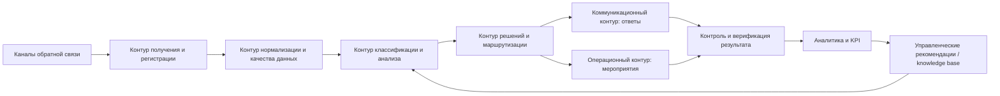
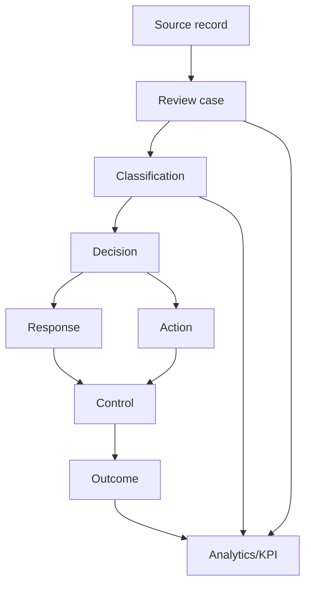
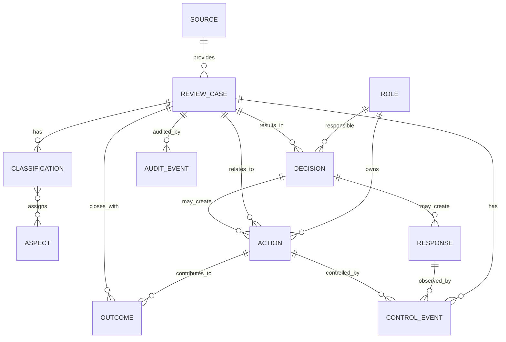

# FeedbackPro — T4: функциональная, информационная и логическая архитектура

Статус: **CONCEPTUAL ARCHITECTURE / IMPLEMENTATION-AGNOSTIC**

## 1. Назначение

Архитектура показывает, какие функции и информационные объекты необходимы для реализации программы FeedbackPro. Она **не предписывает конкретный стек, БД или программный продукт** и не означает обязательную разработку ПО в рамках ВКР.

## 2. Функциональная архитектура

### F1. Получение и регистрация

Функции:
- приём данных из доступных каналов;
- присвоение case ID;
- сохранение source metadata/provenance;
- фиксация исходного текста/рейтинга/даты.

Основание: T3 P1/P2.

### F2. Качество данных

- dedup;
- проверка обязательных полей;
- обезличивание/минимизация ПДн;
- маркировка неполных данных;
- сохранение связи с исходником.

Основание: T3 acquisition evidence; источники №35–36.

### F3. Классификация и анализ

- sentiment/тональность;
- multi-label аспекты;
- C1–C4 screening;
- экспертная верификация;
- повторяемость/кластеры проблем;
- временные и канальные агрегаты.

Основание: P2/P3/P6/P8; №22–27, 40.

### F4. Решения и маршрутизация

- назначение функционального владельца;
- тип решения;
- эскалация;
- целевой срок;
- связь с ответом и мероприятием.

Основание: T2; P4/P5 как проектные принципы.

### F5. Коммуникация

- подготовка/согласование ответа;
- фиксация факта публикации/отправки;
- версия/автор ответа;
- признак необходимости защищённого канала.

Основание: P7; №1, 9, 39.

### F6. Мероприятия

- корректирующее действие;
- владелец;
- срок;
- evidence выполнения;
- связь с одним или несколькими отзывами/проблемой.

### F7. Контроль результата

- просрочка;
- проверка outcome;
- reopen;
- закрывающая причина;
- аудит решений.

### F8. Аналитика/KPI

- источники;
- аспекты;
- C1–C4;
- SLA/временные метрики;
- response vs resolution;
- повторные проблемы;
- drill-down до кейса.

Основание: P6/P7.

## 3. Информационные потоки

Главный принцип: исходная запись не перезаписывается проектными выводами; классификация и решения хранятся как отдельные связанные сущности.

## 4. Логическая модель данных

## 5. Сущности и ключевые поля

### SOURCE
`source_id, source_group, source_name, access/provenance attributes, active_flag`

### REVIEW_CASE
`case_id, external_id, source_id, received_at, review_date, text_original_or_redacted, rating, author_anon, object_ref, current_status, created_at`

### CLASSIFICATION
`classification_id, case_id, sentiment, criticality, criticality_reason, method(rule/expert), verified_flag, classified_by, classified_at, codebook_version`

### ASPECT
`aspect_code, name, definition, active_flag`

Связь review↔aspect — many-to-many.

### DECISION
`decision_id, case_id, decision_type, rationale, responsible_role, target_due_at, escalation_level, status, decided_at`

### RESPONSE
`response_id, decision_id, channel, response_text/reference, approval_required, approved_by, sent_at, public_flag`

### ACTION
`action_id, decision_id/case_id, action_type, description, owner_role, due_at, completed_at, status, evidence_ref`

### CONTROL_EVENT
`control_id, case_id/action_id, event_type, status_before, status_after, checked_by, checked_at, note`

### OUTCOME
`outcome_id, case_id, outcome_type, verified_flag, verified_by, verified_at, evidence_ref, close_reason`

### ROLE
`role_id, functional_role, organization_mapping, active_flag`

### AUDIT_EVENT
`event_id, entity_type, entity_id, event_type, actor, timestamp, old_value_ref, new_value_ref, rationale`

## 6. Справочники

Минимум:
- source groups;
- aspects;
- sentiment categories;
- C1–C4;
- statuses;
- decision types;
- action types;
- outcome/close reasons;
- functional roles;
- escalation triggers.

## 7. Архитектурные ограничения

1. Логическая модель не является SQL-схемой и не требует конкретной БД.
2. ПДн минимизируются; для аналитики предпочтительны обезличенные идентификаторы.
3. Source/provenance не удаляется при нормализации.
4. Audit trail обязателен для C-level, решений, сроков и outcome.
5. Response и Action раздельны.
6. C3/C4 screening и expert verification фиксируются раздельно.
7. Реализация может быть выполнена на CRM/service desk/low-code/табличной системе или специализированном ПО при сохранении этой модели.
