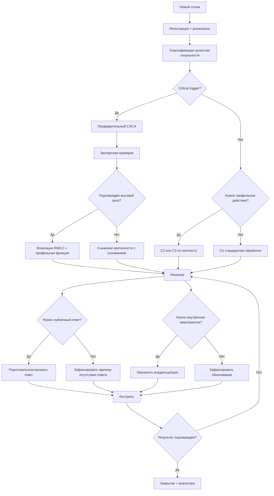

# FeedbackPro — T4: окончательный классификатор и дерево решений

Статус: **CANONICAL TO-BE CLASSIFIER**

## 1. Независимые измерения отзыва

Каждый отзыв описывается минимум по пяти измерениям:

1. **Источник/канал** — site, marketplace, review_service/maps, app, social/messenger, direct, other.
2. **Тональность** — S+, S0, S-, MIX/UNKNOWN при недостатке данных.
3. **Аспекты** — multi-label.
4. **Критичность** — C1–C4.
5. **Стадия обработки** — status процесса.

Дополнительно при наличии данных: регион/точка, категория продукта, повторность, публичность, наличие публичного ответа, связанный предыдущий кейс.

## 2. Аспекты

Окончательный базовый справочник T4 учитывает T3:

| Код | Аспект | Основание |
|---|---|---|
| SERVICE | обслуживание/процесс обслуживания | T3: 869 |
| QUALITY | качество товара/услуги | T3: 551 |
| STAFF | персонал | T3: 502 |
| PRICE | цена/акции/условия | T3: 278 |
| AVAILABILITY | наличие/ассортимент/замены | T3: 242 |
| SUPPORT | поддержка/обратная связь | T3: 85 |
| DELIVERY | доставка/сроки/сборка | T3: 78 |
| RETURN | возврат/возмещение/претензия | T3: 41 |
| DIGITAL | сайт/приложение/цифровой канал | T3: 33 |
| OTHER | иная тема | используется только при невозможности отнести к основным |

Частоты T3 не являются постоянными нормативами; они описывают исследованный корпус и обосновывают состав справочника.

## 3. Критичность

### C1 — низкая

Признаки:
- единичное замечание;
- нет существенного ущерба;
- нет критического триггера;
- стандартная обработка достаточна.

### C2 — средняя

Признаки:
- явное неудовлетворение;
- требуется профильная функция;
- повторяемость/операционный сбой без признаков C3/C4;
- 1–2 звезды могут быть сигналом, но не единственным критерием.

### C3 — высокая

Признаки:
- существенный финансовый/клиентский ущерб;
- повторная нерешённая проблема;
- претензионный конфликт;
- потенциально значимое нарушение процесса;
- высокий риск эскалации/публичности.

### C4 — критическая

Признаки:
- потенциальная угроза жизни/здоровью/безопасности;
- признаки серьёзного правового/ПДн нарушения;
- возможный массовый эффект;
- высокая репутационная/медийная опасность;
- иной случай, требующий немедленного управленческого рассмотрения.

## 4. Critical triggers

Триггер не доказывает факт нарушения; он **обязывает проверить и рассмотреть эскалацию**.

Категории:
- безопасность/здоровье;
- ПДн/конфиденциальность;
- существенный финансовый ущерб;
- права потребителей/претензия;
- массовая повторяемость;
- высокая публичность/медиариск;
- повторный нерешённый кейс;
- отсутствие полномочий на стандартном уровне.

Основания: T3 P3/P8; источники №7, 33, 35, 37.

## 5. Дерево решений

## 6. Правила изменения классификации

- смена C-level должна сохранять предыдущую метку, автора, дату и основание;
- C3/C4 нельзя автоматически закрывать только по факту публикации ответа;
- `UNKNOWN` допустим, если данных недостаточно;
- автоматическое правило может предложить метку, но эксперт имеет право изменить её с объяснением;
- повторный похожий отзыв не копирует критичность механически: контекст проверяется заново.

## 7. Связь с T3

- P2 → единый codebook;
- P3 → критичность независима от рейтинга;
- P6 → multi-label аспекты и агрегаты;
- P8 → screening + ручная верификация C3/C4;
- P7 → ответ и результат не объединяются в одну стадию.
