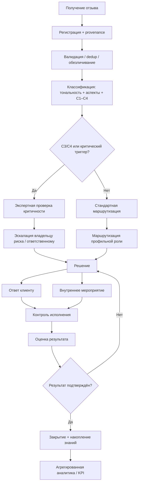

# Методика ЕГ — T4: целевая TO-BE модель

Статус: **CANONICAL PRACTICAL MODEL / NO-CODE**

## 1. Цель TO-BE

Целевая модель превращает работу с отзывами из набора разрозненных реакций в управляемый процесс с единым реестром, многокритериальной классификацией, маршрутизацией, контролем результата и аналитическим контуром.

TO-BE не описывает фактический внутренний процесс сети «Перекрёсток». Это авторская проектная модель, сформированная на базе T2 и evidence T3.

## 2. Канонический процесс

## 3. Шаги процесса

### 3.1 Получение

Источники: карты/агрегаторы, сайт, маркетплейсы, приложение, социальные сети, мессенджеры, формы обратной связи и иные допустимые каналы.

Требование: источник не теряется при последующей нормализации.

Основание: T3 P1; источники №1, 3.

### 3.2 Регистрация и provenance

Минимум фиксируются: source_group, source_name, source_id/URL, дата, текст, доступный рейтинг, объект отзыва, обезличенный автор, дата импорта/регистрации.

Основание: T3 P1/P2; T2 lifecycle.

### 3.3 Валидация, dedup и минимизация ПДн

Проверяются дубли, пустые записи, технический спам, корректность периода/источника; персональные данные обрабатываются по принципу минимизации.

Основание: T3 acquisition pipeline; источники №35–36.

### 3.4 Классификация

Независимые измерения:
- тональность;
- multi-label аспекты;
- критичность C1–C4;
- стадия процесса;
- повторность/системность, если есть evidence.

Основание: T3 P2/P3/P6/P8; источники №22–27, 40.

### 3.5 Экспертная проверка C3/C4

Rule-based/автоматическая метка является screening-сигналом. До управленческого вывода проверяются факты и контекст.

Основание: T3 P8, где C3/C4 = screening, а не подтверждённый инцидент; T2.

### 3.6 Маршрутизация

Отзыв назначается функциональной роли исходя из аспекта, критичности и требуемого типа действия. Название конкретной должности адаптируется организацией при внедрении.

Основание: T2; P4/P5 как проектные требования.

### 3.7 Решение

Возможные решения:
- информационный ответ;
- запрос уточнения;
- сервисное восстановление;
- передача профильной функции;
- корректирующее мероприятие;
- управленческая эскалация;
- мониторинг повторяемости;
- закрытие без дополнительного действия с обоснованием.

### 3.8 Ответ и мероприятие

Создаются как разные сущности процесса.

`Ответ` = внешнее коммуникационное действие.

`Мероприятие` = внутреннее действие по устранению причины/последствия/риска.

Основание: T3 P7; видимый response rate 99,33% не позволяет сделать вывод об устранении причин.

### 3.9 Контроль

Контролируются владелец, срок, статус, просрочка, факт выполнения действия и необходимость повторной эскалации.

Основание: T2 и P5 как проектное требование; не является утверждением об отсутствии такого контроля у «Перекрёстка».

### 3.10 Оценка результата

Результат может быть:
- вопрос решён и подтверждён;
- ответ дан, но мероприятие не завершено;
- требуется повторное действие;
- выявлена системная проблема;
- факт не подтвердился;
- кейс переведён в отдельный юридический/рисковый процесс.

### 3.11 Накопление знаний и аналитика

Закрытые кейсы формируют агрегаты по аспектам, каналам, критичности, времени, повторяемости и результатам.

Основание: T3 P6.

## 4. Статусы процесса

`NEW → REGISTERED → CLASSIFIED → VERIFYING → ROUTED → IN_PROGRESS → RESPONSE_READY/RESPONSE_SENT → ACTION_IN_PROGRESS → CONTROL → VERIFIED → CLOSED`

Дополнительные статусы: `ESCALATED`, `ON_HOLD`, `REOPENED`, `REJECTED_AS_INVALID`.

Статусы являются проектным справочником TO-BE, а не описанием фактической системы организации.

## 5. Принципы качества TO-BE

1. Источник и исходный идентификатор сохраняются всегда.
2. Тональность не задаёт критичность автоматически.
3. Один отзыв может иметь несколько аспектов.
4. C3/C4 подлежат экспертной проверке.
5. Публичный ответ не закрывает кейс автоматически.
6. Закрытие требует зафиксированного результата или обоснованного решения об отсутствии дальнейших действий.
7. Любое изменение критичности/решения должно иметь автора, дату и основание.
8. KPI рассчитываются из событий процесса, а не вводятся вручную как «эффект».
