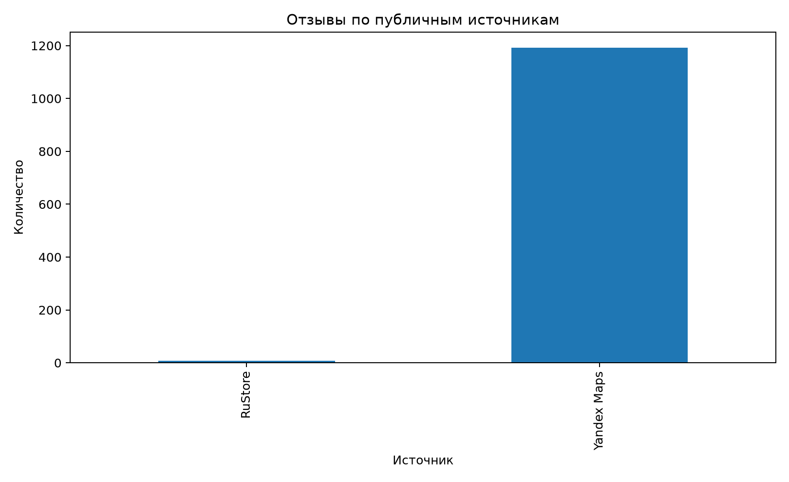
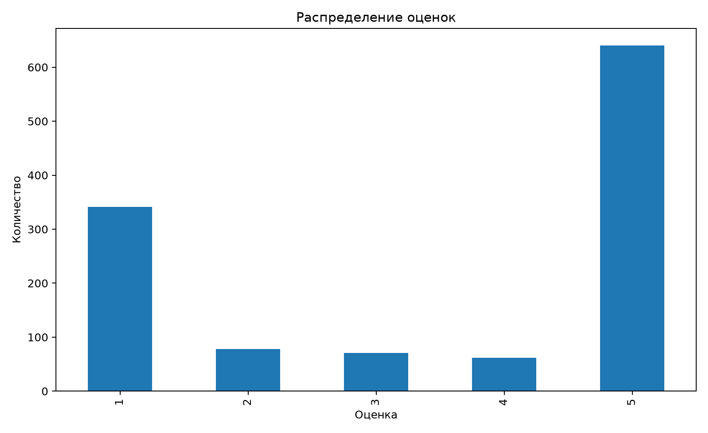
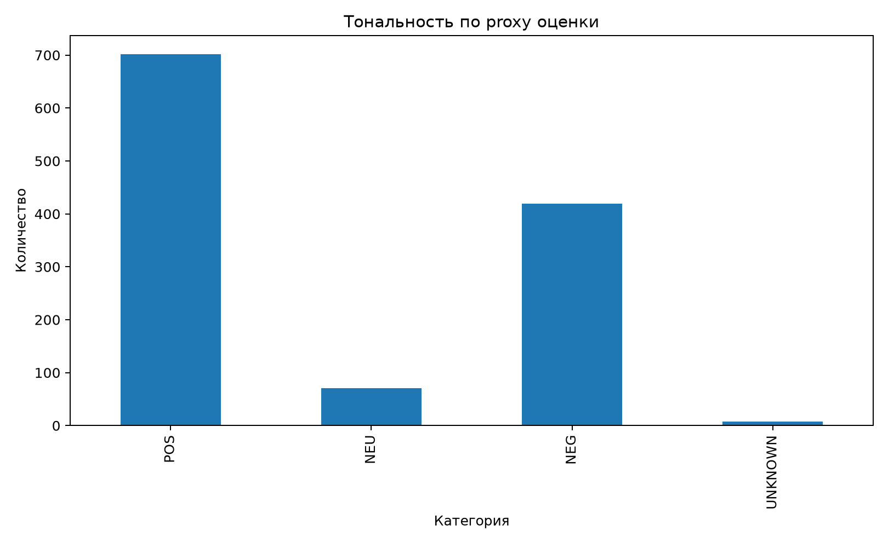
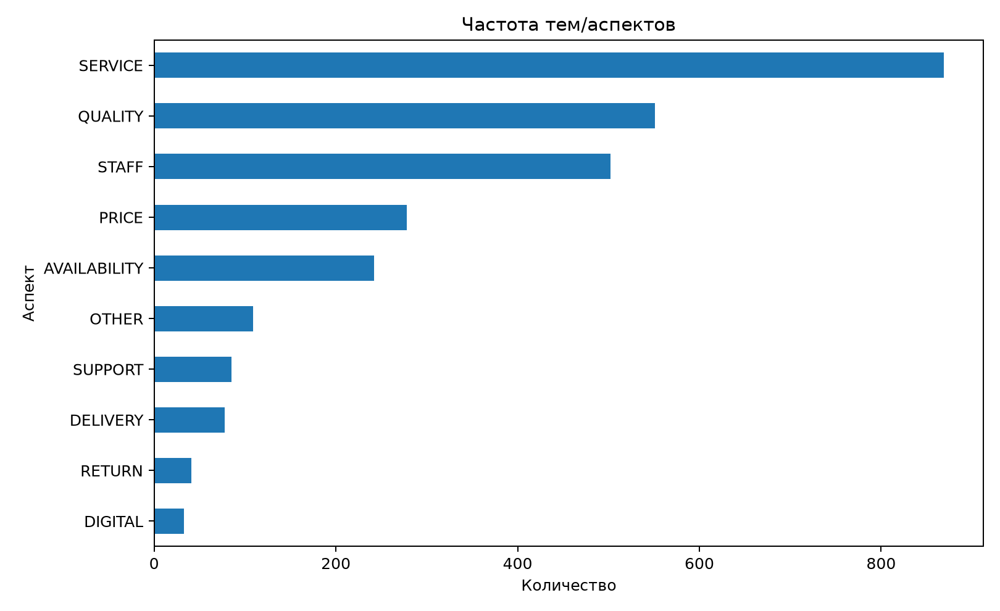
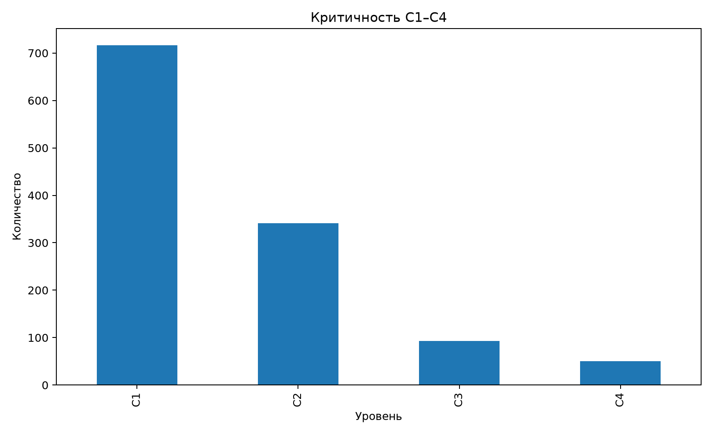
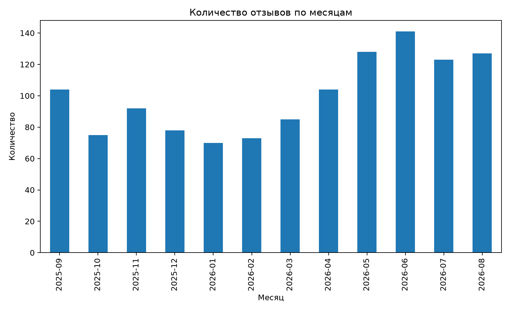

# Глава 2. Анализ публичного контура клиентских отзывов торговой сети «Перекрёсток»

## 2.1. Характеристика объекта исследования, информационных каналов и методики формирования корпуса

В качестве фактического эмпирического объекта исследования выбрана торговая сеть «Перекрёсток». Такое решение позволяет перейти от модельной обезличенной организации к анализу реально существующего коммерческого объекта и использовать публично доступные клиентские отзывы как проверяемую эмпирическую базу. При этом предметом анализа является не внутренняя организационная система компании в целом, а **публично наблюдаемый контур клиентской обратной связи**. Это разграничение принципиально: открытые площадки позволяют анализировать содержание отзывов, рейтинги, даты, повторяемость тем и наличие публичного ответа, однако не раскрывают внутренние SLA, маршруты задач, исполнителей, причины управленческих решений и факт выполнения внутренних корректирующих мероприятий.

Выбор крупной розничной сети соответствует отраслевому контексту развития российской электронной и омниканальной торговли. Отраслевые обзоры Data Insight характеризуют масштаб и динамику российского e-commerce [30], а исследования потребительского поведения показывают значимость отзывов и цифровой репутации при выборе товаров и услуг [2; 28; 29]. Для розничной сети клиентский опыт формируется одновременно в офлайн-магазине, цифровом приложении, доставке, взаимодействии с персоналом, ценовых и промо-механиках, наличии товара, возвратах и работе поддержки. Поэтому отзывы такого объекта позволяют проверить, насколько многокритериальная модель главы 1 применима к разнородным ситуациям.

Эмпирический период установлен с **1 сентября 2025 года по 31 августа 2026 года**. Полный год выбран для снижения риска случайной сезонной концентрации и для возможности анализа распределения отзывов по месяцам. Сформированный acquisition pool содержал **1302 уникальные пригодные записи**, из которых детерминированным способом отобрано **1200 отзывов** в итоговый аналитический корпус. Синтетические записи для достижения объёма не использовались.

Фактически доступные публичные источники представлены двумя группами: Yandex Maps и RuStore. В итоговом корпусе **1192 записи относятся к Yandex Maps и 8 — к RuStore**. Такое распределение не должно интерпретироваться как структура всей обратной связи «Перекрёстка». Оно отражает структуру публично воспроизводимой исследовательской выборки. Отсутствующие закрытые каналы — обращения в собственные формы, call-центр, email, внутреннюю CRM и иные непубличные системы — не дополнялись вымышленными данными.

**Таблица 2.1 — Структура исследовательского корпуса по источникам**

| Источник | Количество | Доля, % |
|---|---:|---:|
| Yandex Maps | 1192 | 99,33 |
| RuStore | 8 | 0,67 |
| **Итого** | **1200** | **100,00** |

Источник: составлено автором по фактическому корпусу T3.

Такой дисбаланс каналов является методическим ограничением исследования. Он не позволяет сравнивать эффективность конкретных площадок на равных выборках, однако не препятствует решению основной задачи: выявить структуру клиентских сигналов и требования к единой методике, которая должна быть способна сохранять provenance и нормализовать неоднородные источники.

При формировании корпуса учитывались общие подходы к работе с крупными наборами русскоязычных отзывов. В качестве методического ориентира рассматривался открытый Yandex Geo Reviews Dataset, содержащий большой массив пользовательских текстов об организациях [31]. Однако данные данного открытого набора не смешивались с фактическим корпусом «Перекрёстка». Это позволяет сохранить чистоту объекта исследования и избежать подмены корпоративного массива данными других организаций.

Базовая запись корпуса включала уникальный внутренний идентификатор, исходный идентификатор при наличии, источник, дату, обезличенный идентификатор автора, доступный рейтинг, текст, URL или иной provenance, а также исследовательские поля. Перед анализом выполнялись проверка периода, удаление дублей, исключение технически непригодных записей и минимизация персональных данных. Такой подход согласуется с принципами минимизации обработки персональной информации [35] и общей рамкой безопасной работы с информацией [36].

Единицей анализа является один уникальный публичный отзыв. Единицей кодирования выступает тот же отзыв, при этом один текст может иметь несколько аспектов. Содержательная схема включает три независимых измерения: тональность-proxy, multi-label аспекты и критичность C1–C4. Дополнительно фиксируются источник, рейтинг, дата и видимый публичный ответ.

Важное ограничение методики связано с тональностью. В T3 **sentiment_proxy не является результатом NLP или экспертного sentiment analysis**. Для записей с доступным рейтингом использовалось прозрачное правило: 4–5 звёзд — POS, 3 звезды — NEU, 1–2 звезды — NEG; при отсутствии надёжного рейтинга — UNKNOWN. Такое решение позволяет анализировать оценочную структуру без приписывания rule-based классификации точности полноценного семантического анализа. Теоретические основания и ограничения автоматической интерпретации обсуждались в §1.3 [22–27; 40].

Аспекты кодировались по multi-label логике. Итоговый базовый справочник включает SERVICE, QUALITY, STAFF, PRICE, AVAILABILITY, SUPPORT, DELIVERY, RETURN, DIGITAL и OTHER. Один отзыв мог одновременно относиться, например, к качеству товара и работе персонала. Это соответствует логике aspect-based analysis, при которой в одном тексте могут сосуществовать оценки нескольких характеристик [40].

Критичность C1–C4 определялась rule-based скринингом по признакам потенциального ущерба, претензионности, безопасности, финансового конфликта, повторяемости и иных факторов. Эти метки не трактуются как подтверждённые нарушения. Для C3/C4 в проектной модели предусмотрена обязательная экспертная проверка. Такая осторожность необходима как с исследовательской, так и с правовой точки зрения: публичное утверждение клиента не равнозначно установленному факту [33; 37].

Для доказательства проблем использовалось правило evidence triangulation. Предварительная гипотеза переводилась в статус поддержанной только при наличии достаточного сочетания наблюдаемого процессного, эмпирического или научно-нормативного основания. Если публичные данные не позволяли сделать вывод о внутреннем процессе, проблема маркировалась `NOT ASSESSABLE INTERNALLY`, а соответствующее решение переносилось в главу 3 только как проектное требование.

Эта граница особенно важна для оценки внутреннего контроля. Высокая доля публичных ответов позволяет утверждать, что на исследованных площадках реакция организации наблюдается, но не позволяет установить, какой внутренний маршрут прошёл отзыв, кто отвечал за исправление причины и существовал ли конкретный SLA. Поэтому анализ главы 2 сознательно отделяет **наблюдаемые факты** от **предположений о внутренней организации**.

Методика количественного анализа включает абсолютные частоты, доли, распределения по рейтингу, sentiment-proxy и критичности, multi-label частоты аспектов, кросс-табуляции `аспект × sentiment-proxy` и `аспект × критичность`, а также распределение по месяцам. Статистическая значимость причинных эффектов не декларируется: задача состоит в описательной аналитике структуры обратной связи и формировании evidence для проектных требований.

## 2.2. Результаты контент-анализа и количественной группировки клиентских отзывов

### Распределение рейтингов и sentiment-proxy

Явный числовой рейтинг доступен для **1192 из 1200 отзывов**. Распределение представлено в таблице 2.2.

**Таблица 2.2 — Распределение отзывов по рейтингу**

| Рейтинг | Количество | Доля от записей с рейтингом, % |
|---:|---:|---:|
| 1 | 341 | 28,61 |
| 2 | 78 | 6,54 |
| 3 | 71 | 5,96 |
| 4 | 62 | 5,20 |
| 5 | 640 | 53,69 |
| **Итого с рейтингом** | **1192** | **100,00** |

Источник: составлено автором по `02_rating_distribution.csv`.

Распределение является поляризованным: более половины оценённых отзывов имеют пять звёзд, одновременно значителен массив однозвёздочных сообщений. Такое соотношение показывает, что средний рейтинг сам по себе был бы недостаточным описанием массива. При агрегировании противоположные оценки могли бы взаимно компенсироваться и скрывать структуру проблем.

По прозрачному rating-proxy получено **702 POS, 71 NEU, 419 NEG и 8 UNKNOWN**. В долях от полного корпуса это соответственно 58,50%, 5,92%, 34,92% и 0,67%.

**Таблица 2.3 — Распределение sentiment-proxy**

| Категория | Количество | Доля, % |
|---|---:|---:|
| POS | 702 | 58,50 |
| NEU | 71 | 5,92 |
| NEG | 419 | 34,92 |
| UNKNOWN | 8 | 0,67 |
| **Итого** | **1200** | **100,00** |

Данный показатель используется только как описательный слой. Нельзя утверждать, что каждый пятизвёздочный текст полностью положителен: пользователь может поставить высокий рейтинг и одновременно указать на конкретный риск или недостаток. Именно это обстоятельство дополнительно проверяется через независимую шкалу критичности.

### Аспектная структура

Наиболее частым аспектом оказался **SERVICE — 869 упоминаний**, далее **QUALITY — 551**, **STAFF — 502**, **PRICE — 278**, **AVAILABILITY — 242**, **OTHER — 109**, **SUPPORT — 85**, **DELIVERY — 78**, **RETURN — 41**, **DIGITAL — 33**. Поскольку классификация multi-label, сумма частот превышает размер корпуса.

**Таблица 2.4 — Частота аспектов**

| Аспект | Количество упоминаний | Доля от 1200 отзывов, %* |
|---|---:|---:|
| SERVICE | 869 | 72,42 |
| QUALITY | 551 | 45,92 |
| STAFF | 502 | 41,83 |
| PRICE | 278 | 23,17 |
| AVAILABILITY | 242 | 20,17 |
| OTHER | 109 | 9,08 |
| SUPPORT | 85 | 7,08 |
| DELIVERY | 78 | 6,50 |
| RETURN | 41 | 3,42 |
| DIGITAL | 33 | 2,75 |

\*Сумма долей превышает 100%, поскольку один отзыв может относиться к нескольким аспектам.

Высокая частота SERVICE, QUALITY и STAFF показывает, что пользовательские отзывы описывают не одну характеристику бренда, а комплекс взаимодействий. Для проектной модели это является прямым аргументом в пользу multi-label codebook. Если каждому отзыву назначать только одну тему, значительная часть содержательной информации будет потеряна.

Сопоставление аспектов с sentiment-proxy дополнительно показывает неоднородность категорий. Например, SERVICE включает 311 NEG, 49 NEU и 507 POS, STAFF — 213 NEG, 23 NEU и 266 POS, QUALITY — 168 NEG, 29 NEU и 352 POS. То есть наиболее частые аспекты одновременно являются источниками и позитивного, и негативного клиентского опыта.

Отдельно выделяются аспекты RETURN и DELIVERY. Для RETURN зафиксировано 36 NEG при 2 POS, для DELIVERY — 55 NEG при 17 POS. Хотя абсолютная частота этих аспектов ниже, их оценочная структура более проблемно ориентирована. Следовательно, приоритизация не должна зависеть только от общей частоты темы: относительно редкая категория может иметь высокий уровень негативности или критичности.

### Критичность

Rule-based распределение критичности составило **C1 — 716, C2 — 341, C3 — 93, C4 — 50**.

**Таблица 2.5 — Распределение C1–C4**

| Уровень | Количество | Доля, % |
|---|---:|---:|
| C1 | 716 | 59,67 |
| C2 | 341 | 28,42 |
| C3 | 93 | 7,75 |
| C4 | 50 | 4,17 |
| **Итого** | **1200** | **100,00** |

Совокупно C3 и C4 составили **143 записи, или 11,92% корпуса**. Эти значения нельзя интерпретировать как 143 подтверждённых серьёзных нарушения. Они показывают число сообщений, которые по разработанным правилам содержат признаки повышенного риска и должны проходить дополнительную проверку.

Ключевым результатом для теоретической модели является наличие **35 C3/C4 отзывов с рейтингом выше двух звёзд или без доступного рейтинга**. Это эмпирически подтверждает, что низкая оценка и критичность не являются взаимозаменяемыми. Если бы приоритет определялся только рейтингом 1–2, часть потенциально значимых сигналов не попадала бы в высокий приоритет. Таким образом, гипотеза P3 получила эмпирическое подтверждение.

Кросс-табуляция аспектов и критичности показывает, что повышенная критичность распределена по разным темам. Для QUALITY зафиксированы 60 C3 и 33 C4, для STAFF — 61 C3 и 25 C4, для SERVICE — 74 C3 и 35 C4, для SUPPORT — 18 C3 и 12 C4. Особенно показателен RETURN: при небольшой общей частоте 41 запись включает 12 C3 и 7 C4. Это подтверждает необходимость анализировать не только частоту, но и структуру критичности внутри аспекта.

**Таблица 2.6 — Фрагмент `аспект × критичность`**

| Аспект | C1 | C2 | C3 | C4 |
|---|---:|---:|---:|---:|
| SERVICE | 509 | 251 | 74 | 35 |
| QUALITY | 338 | 120 | 60 | 33 |
| STAFF | 254 | 162 | 61 | 25 |
| PRICE | 152 | 90 | 23 | 13 |
| AVAILABILITY | 178 | 35 | 13 | 16 |
| SUPPORT | 28 | 27 | 18 | 12 |
| DELIVERY | 18 | 39 | 16 | 5 |
| RETURN | 3 | 19 | 12 | 7 |
| DIGITAL | 10 | 14 | 6 | 3 |

Источник: `07_aspect_x_criticality.csv`.

Из таблицы видно, что аспектная аналитика должна поддерживать минимум два режима: массовые темы и high-criticality темы. SERVICE важен из-за абсолютного объёма, тогда как RETURN и SUPPORT требуют внимания из-за значительной доли более высоких уровней C3/C4 внутри меньшего массива.

### Публичные ответы

Публично видимый ответ организации зафиксирован у **1192 из 1200 отзывов, или 99,33% корпуса**. Для отзывов с оценкой 1–2 видимый ответ присутствовал в 100% исследованных записей. Этот показатель свидетельствует о высокой наблюдаемой активности ответа на изученных площадках.

Однако данный результат не позволяет сделать вывод, что 99,33% клиентских проблем были решены. Публичная страница обычно показывает сам отзыв и ответ, но не внутреннее мероприятие, владельца задачи, факт устранения причины или подтверждение outcome. Поэтому выявлен **observability gap**: коммуникационный результат видим, а операционный результат — нет.

Этот разрыв является важным основанием P7. В целевой модели глава 3 разделяет сущности RESPONSE, ACTION и OUTCOME и запрещает использовать `response_sent` как автоматическое основание закрытия кейса. Такое решение согласуется с теоретическим выводом §1.1 о различии публичной реакции и внутреннего изменения [3; 39].

### Динамика по месяцам

Все двенадцать месяцев исследовательского периода представлены в корпусе. Распределение варьирует от 70 записей в январе 2026 года до 141 в июне 2026 года.

**Таблица 2.7 — Количество отзывов по месяцам**

| Месяц | Количество |
|---|---:|
| сентябрь 2025 | 104 |
| октябрь 2025 | 75 |
| ноябрь 2025 | 92 |
| декабрь 2025 | 78 |
| январь 2026 | 70 |
| февраль 2026 | 73 |
| март 2026 | 85 |
| апрель 2026 | 104 |
| май 2026 | 128 |
| июнь 2026 | 141 |
| июль 2026 | 123 |
| август 2026 | 127 |

Наблюдаемый рост количества записей в мае–августе не интерпретируется как ухудшение или улучшение деятельности компании. Без данных о клиентском потоке, числе транзакций, изменениях числа представленных магазинов и активности площадок нельзя сделать причинный вывод. Для проектной модели важен другой результат: регулярная аналитика должна учитывать временную динамику, но нормировать выводы на доступный контекст.

### Сопоставление с научной и нормативной базой

Результаты анализа подтверждают целесообразность ряда положений первой главы. Разнородность каналов и полей согласуется с необходимостью системного процесса обратной связи [3]. Повторяемость аспектов поддерживает использование структурированной аналитики клиентского опыта [4; 5; 18]. Выделение повышенной критичности независимо от рейтинга соответствует логике управления репутационными и претензионными рисками [7; 33; 37]. Высокая доля публичных ответов при ненаблюдаемом outcome подтверждает необходимость разделения коммуникационной реакции и результата [39].

В то же время фактический материал не позволяет подтвердить ряд потенциальных внутренних проблем. Нельзя утверждать, что в «Перекрёстке» отсутствуют внутренние SLA, единый реестр, владельцы процесса или контроль мероприятий. Публичная площадка просто не раскрывает эти элементы. Научно корректная интерпретация состоит не в критике внутренней системы компании, а в фиксации того, что для полной сквозной управляемости такие элементы **должны быть предусмотрены в целевой методике**.

## 2.3. Выявленные проблемы и требования к совершенствованию процесса работы с отзывами

На основе фактической аналитики и границ наблюдаемости сформирована матрица P1–P8. Важно различать три статуса: подтверждённая проблема публичного контура, поддержанный screening/observability gap и внутренний вопрос, который невозможно оценить по открытым данным.

### P1. Распределённость публичных каналов — SUPPORTED

В корпусе представлены два разных публичных источника. Даже при доминировании Yandex Maps наличие нескольких платформ уже означает необходимость сохранять происхождение записи и уметь объединять данные без потери source metadata. При масштабировании на реальные корпоративные каналы неоднородность будет только увеличиваться.

**Причина:** отзывы создаются на независимых площадках с собственными схемами данных.

**Последствие:** без единой регистрации сложнее сопоставлять повторяемость, темы, критичность и историю работы с кейсом.

**Требование TO-BE:** единый реестр с обязательным provenance: source group, source name, external ID/URL, дата и техническая история импорта.

### P2. Неоднородность данных и необходимость единого codebook — SUPPORTED

Явный рейтинг доступен для 1192 из 1200 записей, а набор полей различается по источникам. Кроме того, рейтинг не заменяет текст и аспектную классификацию.

**Причина:** платформы имеют разные схемы и правила представления отзывов.

**Последствие:** показатели становятся несопоставимыми, если анализировать каждую площадку собственным способом.

**Требование TO-BE:** единый data contract и версионируемый codebook поверх исходных данных при сохранении оригинального provenance.

### P3. Рейтинг/тональность недостаточны для определения приоритета — SUPPORTED

Фактическое evidence — **35 записей C3/C4 при рейтинге выше 2 или отсутствии рейтинга**.

**Причина:** критичность определяется потенциальными последствиями, а не только эмоциональной оценкой.

**Последствие:** система, использующая только низкие звёзды или NEG, способна пропускать значимые сигналы.

**Требование TO-BE:** независимая шкала C1–C4, critical triggers и expert verification высоких уровней.

### P4. Сквозная прослеживаемость внутреннего решения — NOT ASSESSABLE INTERNALLY

Публичные данные не раскрывают внутреннее решение, назначение мероприятия и его результат.

Нельзя формулировать проблему как «у компании нет прослеживаемости». Корректная формулировка: **публичное evidence не позволяет подтвердить сквозную связь между отзывом и внутренним outcome**.

**Проектное требование TO-BE:** `review → classification → decision → response/action → control → outcome`.

### P5. Внутренние SLA, владельцы и статусы — NOT ASSESSABLE INTERNALLY

Открытые площадки не содержат данных о внутренних сроках и владельцах задач.

**Проектное требование TO-BE:** каждый кейс, требующий действия, должен иметь функционального владельца, статус, целевой срок и контроль результата. Данные элементы являются проектными принципами, а не выводом о текущем состоянии «Перекрёстка».

### P6. Повторяемые аспекты требуют регулярной аналитики — SUPPORTED

Семь категорий превышают 5% корпуса: SERVICE, QUALITY, STAFF, PRICE, AVAILABILITY, SUPPORT и DELIVERY. Это показывает, что массив отзывов содержит устойчиво повторяющиеся предметные области.

**Причина:** клиентские сигналы относятся к повторяемым элементам опыта.

**Последствие:** реакция на отдельные отзывы без агрегирования не позволяет видеть масштаб и динамику темы.

**Требование TO-BE:** регулярные агрегаты по аспектам, периоду и критичности с возможностью drill-down к исходному кейсу.

### P7. Публичный ответ не равен подтверждённому результату — SUPPORTED AS OBSERVABILITY GAP

Публичный ответ виден у 99,33% корпуса, однако внутренняя мера и outcome не наблюдаются.

**Причина:** публичная площадка фиксирует коммуникационный слой, но не внутреннее исполнение.

**Последствие:** response rate нельзя использовать как resolved rate.

**Требование TO-BE:** отдельные сущности RESPONSE, ACTION и OUTCOME; закрытие кейса требует зафиксированного результата или обоснованного отсутствия необходимости внутреннего мероприятия.

### P8. Наличие high-criticality screening cases — SUPPORTED

Rule-based codebook выделил **143 C3/C4**, включая 50 C4. Это не означает 143 подтверждённых инцидента, но показывает значимый объём сообщений, требующих повышенного внимания.

**Причина:** часть текстов содержит признаки потенциального финансового, правового, безопасностного или репутационного риска.

**Последствие:** автоматическое или стандартное закрытие таких кейсов создаёт риск пропуска существенного события.

**Требование TO-BE:** C3/C4 verification, эскалационный маршрут, участие legal/compliance для чувствительных случаев и минимизация персональных данных [35–37].

### Итоговая матрица

**Таблица 2.8 — Проблема → причина → последствие → требование TO-BE**

| ID | Статус | Проблема/ограничение | Причина | Последствие | Требование TO-BE |
|---|---|---|---|---|---|
| P1 | SUPPORTED | распределённые публичные источники | независимые платформы | фрагментация данных | единый реестр + provenance |
| P2 | SUPPORTED | неоднородные поля и интерпретации | разные схемы источников | несопоставимость | data contract + codebook |
| P3 | SUPPORTED | рейтинг не отражает критичность | разные природы sentiment и risk | пропуск значимых сигналов | C1–C4 независимо от рейтинга |
| P4 | NOT ASSESSABLE | внутренняя traceability не наблюдается | закрытость внутренних данных | outcome нельзя подтвердить | сквозная цепочка review→outcome |
| P5 | NOT ASSESSABLE | SLA/owners/status не наблюдаются | закрытость внутренних workflow | нельзя оценить управляемость | owner + SLA + status + control |
| P6 | SUPPORTED | повторяемые аспекты | устойчивые элементы CX | системные темы скрываются в единичных кейсах | регулярная aspect analytics |
| P7 | OBSERVABILITY GAP | response ≠ observed outcome | публично виден только коммуникационный слой | response rate может быть ошибочно принят за решение | Response/Action/Outcome раздельно |
| P8 | SUPPORTED SCREENING | 143 C3/C4 screening cases | наличие потенциально значимых рисков | нужен повышенный контроль | verification + escalation + legal/privacy |

Матрица образует доказательный мост от главы 2 к авторской разработке главы 3. Каждое решение «Методики ЕГ» должно быть связано либо с поддержанным эмпирическим наблюдением P1/P2/P3/P6/P7/P8, либо с научно-нормативным основанием. P4/P5 могут использоваться только как проектные принципы.

### Выводы по главе 2

В результате исследования сформирован и проанализирован корпус из 1200 реальных публичных отзывов о торговой сети «Перекрёсток» за период 01.09.2025–31.08.2026. Анализ подтвердил применимость многокритериального подхода: рейтинг, тональность-proxy, аспекты и критичность описывают разные свойства сообщения и не могут заменять друг друга.

Наиболее часто в корпусе встречаются аспекты сервиса, качества, персонала, цены и наличия. При этом меньшие по объёму аспекты, например возвраты и поддержка, характеризуются существенным количеством C3/C4, что подтверждает необходимость сочетать частотный и риск-ориентированный анализ. Независимая шкала критичности получила прямое эмпирическое подтверждение: 35 high-criticality screening cases имели рейтинг выше двух звёзд либо не имели доступного рейтинга.

Публичный ответ организации наблюдается у 99,33% корпуса, но это не даёт оснований считать проблемы решёнными. Внутреннее мероприятие и outcome не видны на площадке. Поэтому итоговая модель должна отделять response от action и verified outcome.

Подтверждены P1, P2, P3 и P6; P7 подтверждена как observability gap; P8 — как наличие rule-based high-criticality screening cases. P4 и P5 не оцениваются как фактические внутренние недостатки компании из-за отсутствия публичного evidence. Таким образом, глава 2 формирует доказательно ограниченный набор требований, на котором далее строится организационно-методическая программа «Методика ЕГ».