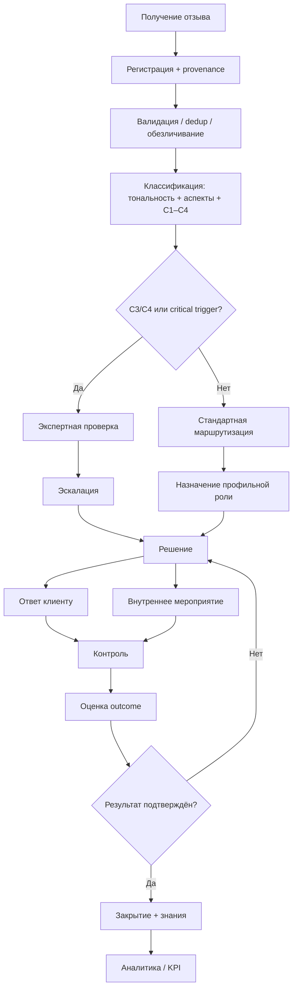
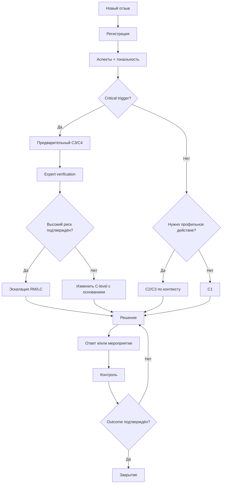
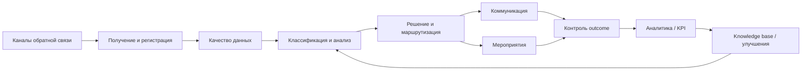
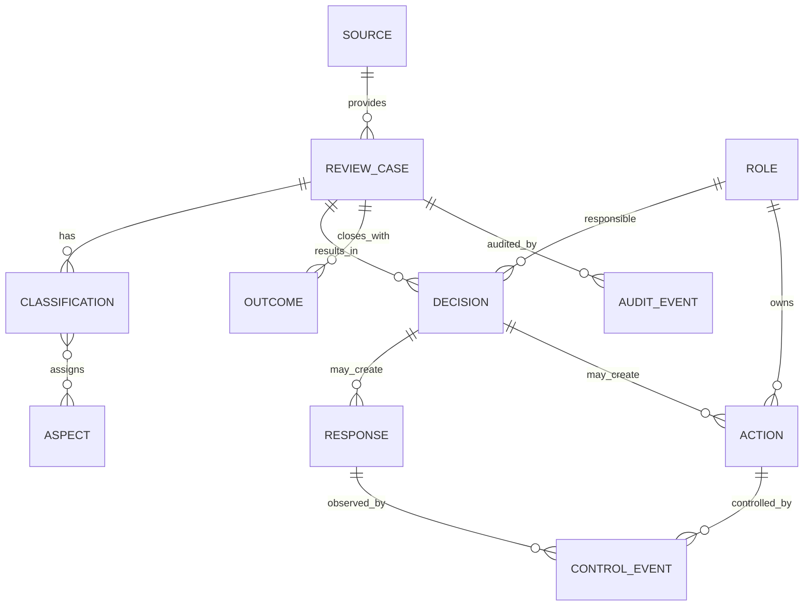

# Глава 3. Разработка организационно-методической программы «Методика ЕГ» и плана её внедрения

## 3.1. Обоснование концепции и целевая процессная модель TO-BE

Результаты главы 2 показали, что совершенствование работы с отзывами не сводится к выбору одного цифрового инструмента. Эмпирически подтверждены распределённость публичных источников, неоднородность данных, необходимость multi-label классификации, независимость критичности от рейтинга, повторяемость аспектов и разрыв между публичным ответом и наблюдаемым результатом. При этом внутренние SLA, владельцы и маршруты задач не оценивались как фактические недостатки сети «Перекрёсток». Следовательно, практическое решение должно одновременно отвечать на подтверждённые проблемы публичного контура и сохранять корректную границу между evidence и проектными предположениями.

При разработке практической части были рассмотрены четыре альтернативы. **A0** предполагает сохранение раздельной работы по площадкам. Данный подход требует минимальных изменений, однако не решает проблемы P1 и P2, поскольку данные остаются распределёнными и интерпретируются в логике конкретного канала. **A1** представляет собой единый реестр или таблицу, куда отзывы сводятся вручную. Такой вариант создаёт общий массив и позволяет выполнять базовую аналитику, но сам по себе не задаёт полноценные правила маршрутизации, эскалации и контроля результата.

**A2** — использование универсальной CRM, service desk или low-code-платформы. Такой вариант способен поддерживать статусы, роли, сроки и audit trail, однако выбор конкретного продукта без данных об ИТ-ландшафте организации был бы необоснованным. Кроме того, типовая карточка обращения не обязательно учитывает специфику публичного отзыва, multi-label аспектов, независимой критичности и разграничения коммуникационного ответа и внутреннего мероприятия.

**A3** — разработка самостоятельной организационно-методической программы, определяющей процесс, классификатор, роли, регламент, KPI и информационную модель независимо от конкретной технической платформы. Именно эта альтернатива получила рабочее название **«Методика ЕГ»**. Преимущество подхода состоит в том, что объектом проектирования становится не программный продукт, а управляемый жизненный цикл обратной связи. Реализовать его впоследствии можно в таблице, CRM, service desk, low-code-системе или специализированном решении.

Такой выбор соответствует теоретическим представлениям об обратной связи как процессе [3], подходам к управлению клиентским опытом [4; 5; 18; 19] и логике системного менеджмента качества [32–34]. В PR-контуре решение также соответствует пониманию цифровой репутации как объекта управляемой коммуникационной деятельности [9; 21] и необходимости учитывать репутационные риски [7].

Целевой процесс TO-BE строится по принципу сквозной прослеживаемости:

**получение → регистрация и provenance → валидация/dedup/обезличивание → классификация → проверка C3/C4 → маршрутизация → решение → ответ и/или мероприятие → контроль → оценка результата → закрытие → аналитика и накопление знаний**.

В отличие от теоретического верхнеуровневого цикла главы 1, TO-BE конкретизирует контрольные точки, ответственных и обязательные информационные объекты.

Первый принцип TO-BE — **сохранение происхождения данных**. P1/P2 показывают, что источники различаются по составу полей. Поэтому нормализация не должна уничтожать связь с исходным каналом. В карточке кейса сохраняются source group, source name, внешний ID/URL, дата и техническая история регистрации. Такой подход позволяет проверять агрегированный вывод на уровне исходной записи и обеспечивает воспроизводимость.

Второй принцип — **разделение исходного текста и интерпретации**. Тональность, аспекты и C1–C4 хранятся как отдельный аналитический слой. Если классификация меняется после проверки, прежняя версия не удаляется, а фиксируется в audit trail. Это особенно важно для спорных C3/C4 и соответствует общей методической осторожности в применении автоматизированных методов [22–27; 40].

Третий принцип — **response ≠ action ≠ outcome**. P7 показала, что публичный ответ виден почти во всём исследованном корпусе, однако внутреннее мероприятие и его итог не наблюдаются. В «Методике ЕГ» коммуникационный ответ не может автоматически закрыть кейс. Если проблема требует внутреннего действия, создаётся отдельное мероприятие с владельцем и сроком. Закрытие возможно только после фиксации outcome либо после обоснованного решения, что дальнейшее мероприятие не требуется. Исследования управленческих ответов на отзывы подтверждают значимость коммуникационной реакции [39], но методика расширяет данный контур до проверки результата.

Четвёртый принцип — **критичность независима от тональности**. Эмпирическое evidence P3 показало 35 C3/C4 записей с рейтингом выше двух звёзд либо без рейтинга. Поэтому приоритет обработки определяется не только оценочной полярностью, а потенциальным ущербом и critical triggers. Это позволяет выявлять нейтрально сформулированные финансовые, правовые, безопасностные или массовые риски.

Пятый принцип — **управление повторяемостью**. P6 показывает, что сервис, качество, персонал, цена и наличие повторяются в сотнях сообщений. Целевая модель должна позволять связывать отдельный кейс с проблемным кластером и отслеживать, уменьшается ли повторяемость после корректирующего мероприятия. Иначе организация остаётся в режиме реакции на единичные тексты и не использует обратную связь как источник развития клиентского опыта [4; 18; 19].

Для процесса предложен проектный справочник статусов: `NEW → REGISTERED → CLASSIFIED → VERIFYING → ROUTED → IN_PROGRESS → RESPONSE_READY/RESPONSE_SENT → ACTION_IN_PROGRESS → CONTROL → VERIFIED → CLOSED`. Дополнительно используются `ESCALATED`, `ON_HOLD`, `REOPENED`, `REJECTED_AS_INVALID`. Эти статусы не являются описанием существующей системы «Перекрёстка»; они составляют авторское предложение для организации целевого процесса.

Закрывающие причины также формализуются. Среди них: `RESOLVED_CONFIRMED`, `ACTION_COMPLETED`, `RESPONSE_ONLY_NO_ACTION_REQUIRED`, `NOT_CONFIRMED`, `DUPLICATE_LINKED`, `OUT_OF_SCOPE`, `TRANSFERRED_TO_FORMAL_CLAIM_PROCESS`. Использование `RESPONSE_SENT` как причины закрытия запрещается, поскольку это событие коммуникации, а не подтверждённый outcome.

Выбор «Методики ЕГ» как no-code практического результата делает разработку применимой независимо от зрелости ИТ-инфраструктуры. В минимальном варианте процесс может реализовываться организационно с единым реестром. При наличии CRM или service desk методика становится функциональной спецификацией для настройки. При последующей цифровой трансформации она может служить основой специализированной автоматизации [15; 26].

## 3.2. Классификатор, роли, регламент, архитектура и проектные представления «Методики ЕГ»

### Итоговый классификатор

Классификатор включает пять обязательных измерений: источник, тональность, multi-label аспекты, критичность и стадия обработки. Дополнительные измерения — география, объект, продуктовая категория, повторяемость, публичность и связанный предыдущий кейс — используются только при наличии данных.

Итоговый аспектный справочник сформирован с учётом фактических частот T3: SERVICE, QUALITY, STAFF, PRICE, AVAILABILITY, SUPPORT, DELIVERY, RETURN, DIGITAL и OTHER. Справочник является базовым и допускает версионированное изменение, если новая категория устойчиво появляется в фактическом материале. Это соответствует принципам аспектного анализа [22–24; 40].

Шкала критичности включает четыре уровня. **C1** — локальное замечание без существенного ущерба; **C2** — кейс, требующий профильной функции или приоритетной обработки; **C3** — потенциально существенный ущерб, повторная нерешённая проблема, претензионный конфликт или высокий риск эскалации; **C4** — потенциальный критический правовой, безопасностный, массовый или репутационный эффект. Важное правило: C3/C4 являются screening-уровнями до экспертной верификации.

К critical triggers относятся признаки угрозы жизни или здоровью, существенного финансового ущерба, нарушения персональных данных, массовой повторяемости, высокой публичности, претензионного конфликта или повторного неустранённого случая. Правовая рамка чувствительных кейсов опирается на требования к персональным данным и информации [35; 36], законодательство о защите прав потребителей [37] и процессные принципы работы с претензиями [33].

Дерево решений строится так, чтобы critical trigger не приводил к автоматическому обвинительному выводу. Он запускает проверку фактов, после которой критичность может быть подтверждена или изменена с обязательным основанием.

### Функциональные роли и RACI

Поскольку фактические должности и внутренняя структура «Перекрёстка» не исследовались, предлагаются **функциональные роли**, которые организация должна сопоставить со своими должностями при внедрении. Выделены: владелец процесса; координатор обратной связи/PR; аналитик; профильный исполнитель; клиентский сервис; юридическая/комплаенс-функция; руководитель/владелец риска; контролёр результата.

Такая ролевая модель связана с процессным пониманием обратной связи [3], общими принципами менеджмента качества [34] и PR-коммуникации как организованной деятельности [20]. В небольшой организации отдельные функции могут совмещаться, но ответственность за критические решения и outcome не должна исчезать.

**Таблица 3.1 — Укрупнённая RACI «Методики ЕГ»**

| Этап | Владелец процесса | Координатор | Аналитик | Профильная функция | Клиентский сервис | Legal/Compliance | Руководитель риска | Контроль |
|---|---|---|---|---|---|---|---|---|
| правила/codebook | A | R | R | C | C | C | I | C |
| регистрация | I | A/R | C | I | R | I | I | I |
| классификация | I | A | R | C | C | I | I | I |
| C3/C4 verification | I | R | R | C | C | A/C | A/C | I |
| маршрутизация | A | R | C | C | C | C | C | I |
| решение | I | R/A | C | R | R | C | A для C3/C4 | I |
| внутреннее мероприятие | I | C | I | A/R | C | C | C | I |
| контроль/outcome | A | R | C | C | C | I | I | R |
| аналитика/KPI | A | C | R | I | I | I | I | C |

Проектные SLA распределяются по критичности. Для C1 ориентиром является triage до одного рабочего дня, для C2 — до четырёх рабочих часов, для C3 — до одного рабочего часа, для C4 — максимально оперативная регистрация с целевым ориентиром до 15 минут и немедленной эскалацией. Эти значения являются **проектными предложениями**, а не установленными нормативами и не фактическими SLA «Перекрёстка». Перед пилотом организация должна либо подтвердить их, либо утвердить собственные пороги.

Регламент включает 12 последовательных правил: регистрация case ID и provenance; очистка и минимизация ПДн; классификация; verification C3/C4; маршрутизация; фиксация решения; подготовка коммуникации; выполнение внутреннего мероприятия; контроль; закрытие; повторное открытие; включение повторяющихся аспектов в управленческую аналитику.

Правила публичного ответа исходят из принципа фактической корректности: ответ подтверждает получение сообщения, не признаёт спорные факты до проверки, объясняет следующий шаг, не раскрывает лишние персональные или внутренние сведения и не подменяет внутреннее мероприятие. Для чувствительных кейсов вводится legal/compliance review. Такая логика соответствует роли коммуникационной реакции в цифровой репутации [9; 21; 39].

### Функциональная и информационная архитектура

Архитектура «Методики ЕГ» является implementation-agnostic. Она описывает необходимые функции, но не предписывает стек, базу данных или программный продукт.

Информационный принцип состоит в разделении исходной записи и производных сущностей. Минимальная логическая модель включает SOURCE, REVIEW_CASE, CLASSIFICATION, ASPECT, DECISION, RESPONSE, ACTION, CONTROL_EVENT, OUTCOME, ROLE и AUDIT_EVENT.

`REVIEW_CASE` хранит исходный текст или его обезличенную версию, дату, канал, рейтинг и статус. `CLASSIFICATION` хранит sentiment, C-level, метод классификации, verification flag и версию codebook. `DECISION` описывает решение и его основание. `RESPONSE` и `ACTION` разделены. `OUTCOME` фиксирует верифицированный результат. `AUDIT_EVENT` обеспечивает прослеживаемость изменений.

Такая модель позволяет реализовать D01–D18 независимо от конкретной технологии. Например, в V1 сущности могут быть представлены листами и связанными таблицами; в V2 — объектами CRM/service desk; в V3 — специализированной системой.

### Проектные представления S01–S10

Для визуализации информационной архитектуры сформирован комплект из десяти концептуальных экранов. Они не являются доказательством программной реализации, а показывают, как функции могут быть представлены пользователю.

**S01 «Дашборд»** содержит новые отзывы, C3/C4 open, SLA, verified resolution, динамику, топ аспектов и просроченные мероприятия. **S02 «Список отзывов»** обеспечивает фильтрацию по источнику, аспекту, C-level, статусу и сроку. **S03 «Карточка отзыва»** визуально разделяет оригинальный текст и аналитическую интерпретацию, показывает provenance и историю решений.

**S04 «Импорт/получение»** отображает mapping источника, raw/accepted/excluded/duplicates и качество provenance. **S05 «Решения»** содержит реестр управленческих решений. **S06 «Карточка решения»** показывает rationale, требование публичного ответа, внутреннее мероприятие, владельца, срок и outcome. **S07 «Контроль»** формирует очереди просроченных, непроверенных C3/C4, случаев «ответ дан — мероприятие не завершено» и reopened cases.

**S08 «Аналитика»** предоставляет динамику, аспекты, критичность, response vs verified resolution и repeat problems. **S09 «Справочники»** управляет версиями аспектов, critical triggers, ролей, типов решений и SLA. **S10 «Настройки/методика»** содержит codebook version, privacy rules, RACI mapping, KPI definitions и evidence policy.

Канонический принцип интерфейсов — показать пользователю разницу между **данными источника**, **rule-based/автоматическим предположением** и **экспертно подтверждённым решением**. Это снижает риск превращения аналитической метки в некритично принимаемый факт.

## 3.3. KPI, план внедрения, риски и методика будущей оценки эффективности

### Система KPI

KPI «Методики ЕГ» предназначены для измерения качества процесса и результата. Они не являются заранее заданными показателями эффективности «Перекрёстка». В T5 фиксируются формулы, по которым показатели должны рассчитываться после реального пилота.

К показателям качества данных относятся **provenance completeness**, classification completeness и data-quality exception rate. К временным — median time to triage и median time to route. К процессным — SLA compliance, C3/C4 verification rate, action coverage и traceability completeness. К результативным — verified resolution rate, reopen rate, repeat problem rate и corrective action closure rate. Public response rate рассчитывается отдельно и не подменяет verified resolution.

Такое разделение соответствует принципам мониторинга удовлетворённости [32], управления претензиями [33] и процессного менеджмента [34]. Одновременно оно защищает исследование от слишком простой интерпретации, при которой скорость или количество ответов становятся единственным критерием качества.

Для долей используется формула `K = N_success / N_applicable × 100%`. Для временных показателей предпочтительна медиана, поскольку она менее чувствительна к выбросам. Изменение долей в BEFORE/AFTER рассчитывается в процентных пунктах: `Δ_pp = AFTER% – BEFORE%`. Для времени — `Δ_time = AFTER_median – BEFORE_median`.

### Варианты внедрения

Предусмотрены три уровня внедрения. **V1 — регламент + единый реестр**: минимальный технологический порог, ручная маршрутизация и расчёт KPI. **V2 — адаптация существующей CRM/service desk/low-code**: методика реализуется поверх корпоративной платформы с карточками, статусами, сроками и отчётностью. **V3 — специализированный цифровой контур**: интеграции с каналами, rule/NLP-support, workflow и расширенная аналитика.

Для первой апробации рекомендуется V1 или V2. Это позволяет проверять собственно процессную гипотезу без смешения эффекта методики и эффекта длительной разработки нового ПО. V3 может рассматриваться как последующий этап цифровой трансформации [15; 26].

### Этапы E0–E8

План внедрения содержит девять последовательных этапов. **E0** — решение о пилоте: назначение sponsor, владельца и scope. **E1** — подготовка: инвентаризация каналов, baseline window, данные и evidence repository. **E2** — адаптация: согласование аспектов, critical triggers, SLA, реальных ролей и KPI. **E3** — обучение и dry-run. **E4** — сбор BEFORE baseline. **E5** — пилот по TO-BE. **E6** — AFTER measurement. **E7** — оценка и решение. **E8** — масштабирование при положительном Gate.

Пилотный scope рекомендуется ограничивать 1–2 каналами, одной бизнес-зоной или группой объектов, фиксированным периодом и замороженной версией codebook. Изменение scope во время пилота оформляется formal change event; иначе BEFORE/AFTER теряет сопоставимость.

### Ресурсы и обучение

Внедрение требует организационных, методических, информационных и технических ресурсов. Организационно необходимы владелец пилота, функциональные исполнители и decision authority. Методически — согласованные codebook, RACI, SLA, KPI и evidence plan. Информационно — доступ к источникам, минимальный data contract и правила ПДн. Технический уровень зависит от V1–V3.

Обучение участников обязательно до пилота. Оно должно включать назначение методики, классификацию аспектов, C1–C4, правила эскалации, разграничение response/action/outcome, работу с ПДн и фиксацию evidence. Dry-run на тестовой выборке позволяет выявить неоднозначность codebook до начала BEFORE/AFTER.

### Карта рисков

Сформирован риск-регистр R1–R20. К наиболее существенным относятся неполный охват каналов, несогласованная классификация, ложная или пропущенная C3/C4 эскалация, подмена результата публичным ответом, нарушение ПДн, обход регламента, формальный SLA, перегрузка первой линии, несопоставимость BEFORE/AFTER и изменение порогов успеха после получения результата.

Отдельно определены stop-risks. Пилот приостанавливается при существенном privacy/security incident, систематической утрате provenance, невозможности воспроизвести KPI, использовании несовместимых формул BEFORE/AFTER, массовом применении неутверждённого codebook или отсутствии владельца C4-кейсов.

Такая модель риска важна для предотвращения ситуации, когда повышение скорости достигается ценой ухудшения безопасности или качества решений. Поэтому у пилота есть обязательные guardrails, которые нельзя компенсировать улучшением другого показателя.

### BEFORE/AFTER методика

Основная единица наблюдения — один `REVIEW_CASE`, прошедший через границы сравниваемого процесса. Дополнительные единицы — ACTION, CONTROL_EVENT и OUTCOME. BEFORE формируется на фактической baseline-выборке до применения «Методики ЕГ», AFTER — на сопоставимой выборке после запуска пилота.

Ключевое правило оценки — **preregistration**. Состав выборки, inclusion/exclusion, формулы KPI, версия codebook, пороги успеха, guardrails и stop-risks фиксируются до просмотра AFTER. Это предотвращает post-hoc изменение методики ради желаемого результата.

Сопоставимость требует одинакового pilot scope, каналов, правил включения и исключения, версии аспектов, формул KPI, логики дублей и privacy rules. При невозможности полного совпадения различие фиксируется как limitation. Одинаковое абсолютное число отзывов не обязательно для долей и медиан, но минимальный объём должен быть утверждён до пилота.

Не формируется искусственный единый «индекс эффективности» с произвольными весами. Скорость, полнота traceability, verified resolution, C3/C4 safety и privacy относятся к различным измерениям и рассматриваются совместно через gates и guardrails.

Все preregistered KPI включаются в итоговый отчёт независимо от направления изменения. Anti-cherry-picking rule запрещает исключать метрику только потому, что она не улучшилась. Это повышает достоверность будущей апробации.

### Evidence pack и decision gate

Для пилота формируется evidence pack: protocol, scope, версии методики, RACI, codebook, SLA, BEFORE и AFTER datasets, data-quality reports, event log, training evidence, exception/change log, C3/C4 verification log, risk snapshots, KPI report и финальный decision record.

Для каждого вывода должна восстанавливаться цепочка: **исходные записи → фильтр → версия методики → формула → агрегат → вывод**. Если KPI невозможно воспроизвести, он исключается из доказательной базы до устранения проблемы.

По итогам пилота допускаются три решения. **«Масштабировать»** — при PASS integrity gates, safety/privacy guardrails и заранее утверждённых success criteria. **«Корректировать»** — если evidence воспроизводимо, stop-risk отсутствует, но часть целей не достигнута или выявлены исправимые проблемы codebook, RACI, SLA или обучения. **«Остановить»** — если integrity не восстанавливается, risk неприемлем, guardrails устойчиво ухудшаются или процесс создаёт несоразмерную нагрузку.

Важно, что решение «остановить» не доказывает ошибочность теоретической модели ВКР. Оно относится к конкретному варианту внедрения в определённом организационном контексте.

### Выводы по главе 3

В третьей главе разработан самостоятельный практический результат ВКР — организационно-методическая программа **«Методика ЕГ»**. На основе сравнения альтернатив выбран implementation-agnostic подход, в котором процесс и правила первичны по отношению к программному инструменту.

Сформирована целевая TO-BE модель, обеспечивающая единый provenance, многокритериальную классификацию, независимую C1–C4, expert verification high-criticality случаев, функциональную маршрутизацию, разделение response/action/outcome, контроль и аналитику. Разработаны функциональная RACI, проектные SLA, регламент, логическая модель данных и концептуальные представления S01–S10.

Практическая разработка непосредственно трассируется к evidence главы 2 и научно-нормативной базе [1; 3–5; 7; 9; 18–23; 26; 32–40]. При этом P4/P5 не превращены в необоснованную критику компании: владельцы, SLA и внутренний контроль сформулированы как элементы целевой модели.

Разработан план внедрения V1–V3 и этапы E0–E8, риск-регистр R1–R20, программа обучения и preregistered BEFORE/AFTER методика. Фактические результаты пилота не моделировались. Таким образом, глава 3 показывает не достигнутый эффект, а **воспроизводимый способ внедрить и затем честно проверить «Методику ЕГ»**.